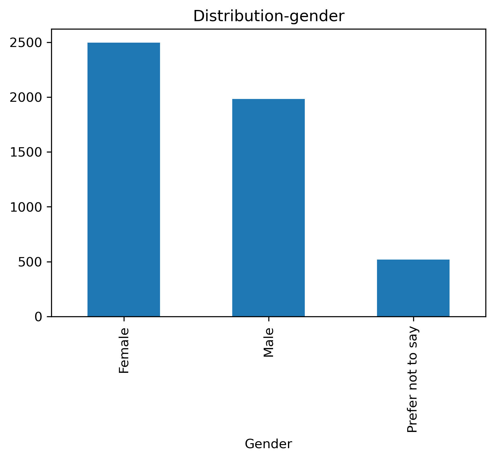
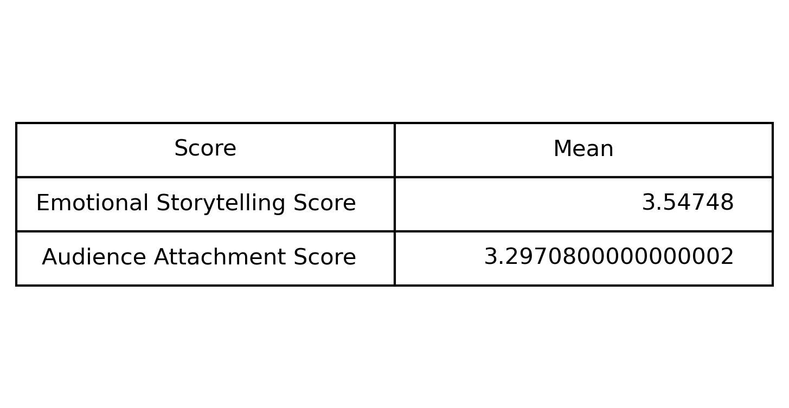
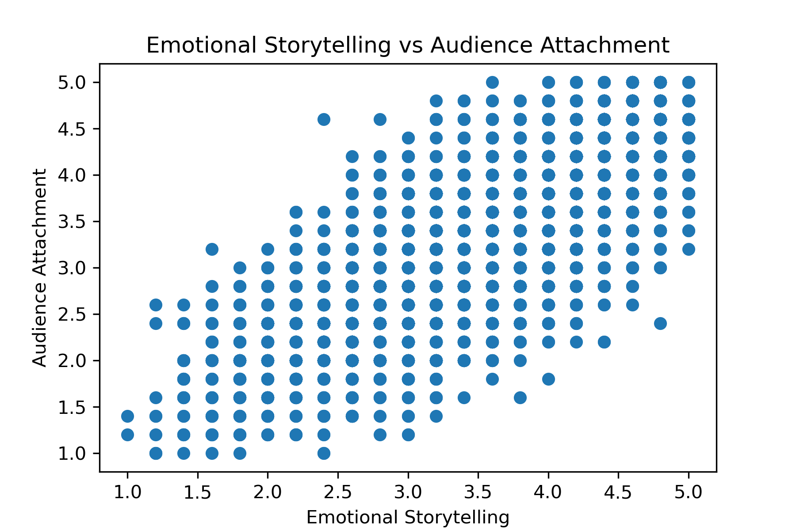
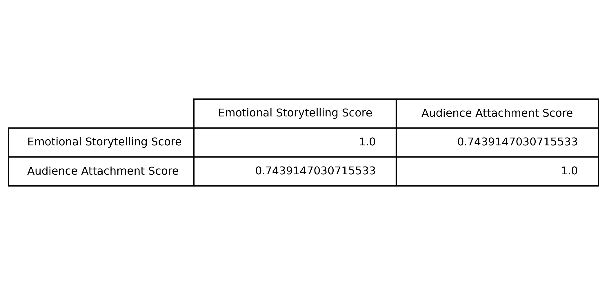
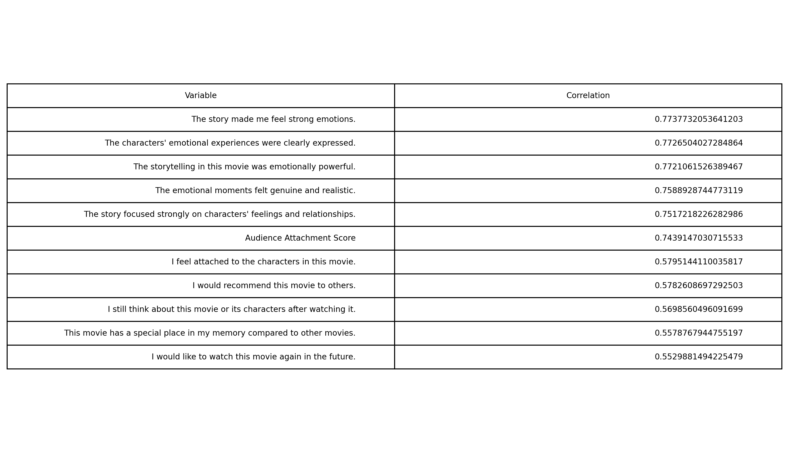
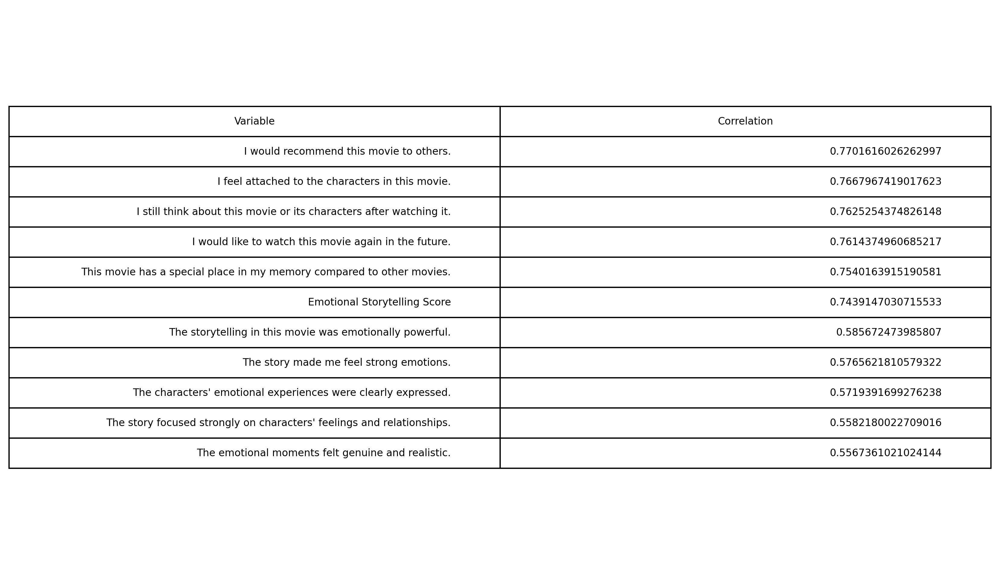
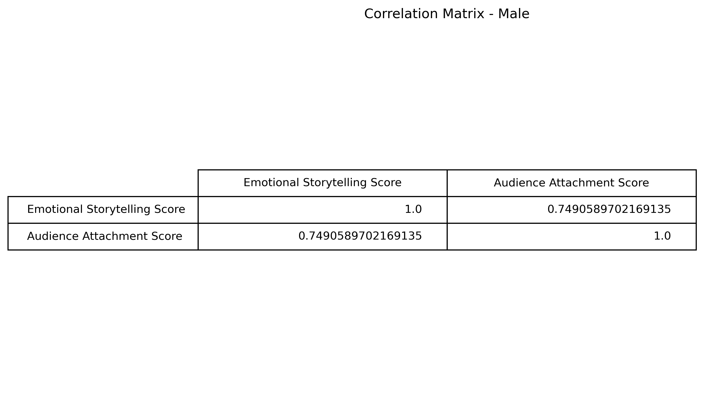
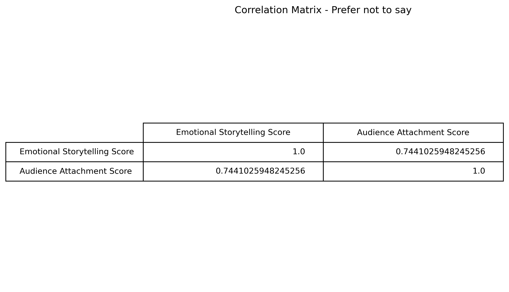

# Emotional Storytelling vs Audience Attachment

## Project Overview

This project presents an Exploratory Data Analysis (EDA) of a survey dataset that investigates the relationship between **emotional storytelling in movies** and **audience emotional attachment**.

The dataset contains **5,000 survey responses** from individuals who reported a movie that had a strong emotional impact on them. The goal of the analysis is to understand whether stronger emotional storytelling leads to deeper emotional attachment to films and characters.

---

## Dataset

The dataset includes:

- **Demographics**
  - Age
  - Gender

- **Viewing habits**
  - Most recent impactful movie
  - Viewing frequency
  - Time since last viewing

- **Evaluation questions (Likert scale 1–5)** measuring:
  - Storytelling emotional quality
  - Character emotional depth
  - Audience emotional engagement

- **Computed variables**
  - `Emotional Storytelling Score`
  - `Audience Attachment Score`

---

## Objectives

The main objectives of this project are:

- Perform **Exploratory Data Analysis (EDA)**
- Investigate the relationship between **storytelling quality** and **audience attachment**
- Compute **correlation metrics**
- Visualize patterns in the data

---

## Tools Used

- Python
- Pandas
- Matplotlib

---

## Key Analysis

The analysis includes:

- Data inspection and preprocessing
- Correlation matrix
- Scatter plot analysis
- Exploration of storytelling metrics and audience responses

---
## Exploratory analysis

As we can see, the majority of those interviewed are women.
Furthermore, we can see that the average of Emotional Storytelling Score is greater than the average of Audience Attachment Score.

## Main Insight

Looking at the graph below, we can conclude that there is a strong positive correlation between Emotional Storytelling Score and Audience Attachment Score.

This observation is confirmed when we calculate the correlation between the scores.

As we can see, there is a strong relationship (approximately 0.74) between emotional storytelling vs audience attachment.

Furthermore, we can observe the questions that are most closely related to each score:

At last, we can see that for men the correlation is even stronger:

## Conclusion

The analysis suggests a strong positive relationship between emotional storytelling and audience attachment.

Movies that emphasize emotional depth, character development, and genuine emotional moments tend to create stronger connections with audiences.

This result highlights the importance of emotional storytelling in shaping memorable cinematic experiences.

